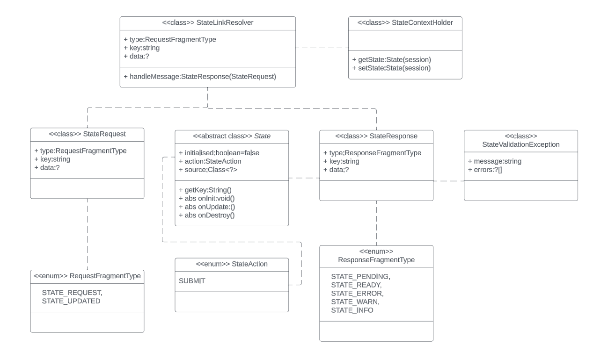
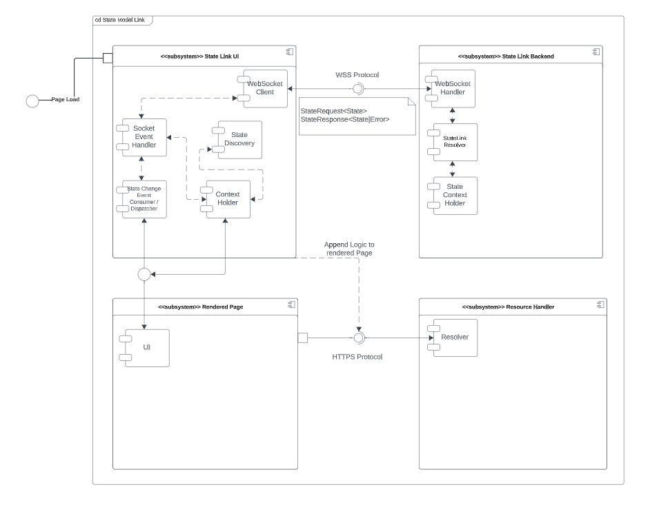
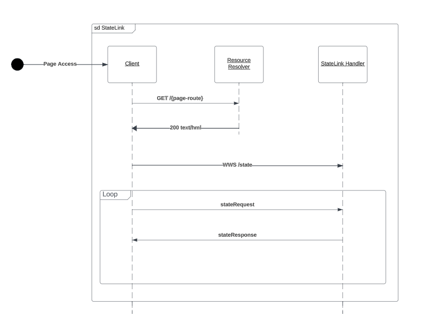

# State Link Pattern
The aim of state link pattern address common issues and drawbacks of MVC pattern,
improve development speed, maintainability and reduce development complexity.

## MVC Flow
In typical Model-View-Controller application, model declaration is followed by declaration of controller:
```java
// Declare a model layer
public record Todo(
        String id,
        String title,
        boolean done
) {}

// Declare controller layer
@Controller
@RequestMapping("/mvc")
public class TodoController {


    @Autowired
    TodoStoreService todoStoreService;


    @GetMapping
    public String todoHome(
            Model model
    ) {
        model.addAttribute("todos", todoStoreService.getTodos());
        return "mvc";
    }

    @PostMapping("/add")
    public String add(
            @ModelAttribute("todo") Todo todo,
            Model model
    ) {
        todoStoreService.addTodo(todo);
        model.addAttribute("todos", todoStoreService.getTodos());
        return "redirect:/mvc";
    }
    @PostMapping("/change-status")
    public String updateTodo(
            @ModelAttribute("todo") Todo todo,
            Model model
    ) {
        todoStoreService.updateTodo(todo);
        model.addAttribute("todos", todoStoreService.getTodos());
        return "redirect:/mvc";
    }

    @PostMapping("/delete")
    public String deleteTodo(
            @ModelAttribute("id") String id,
            Model model
    ) {
        todoStoreService.deleteTodo(id);
        model.addAttribute("todos", todoStoreService.getTodos());
        return "redirect:/mvc";
    }
}
```
Define a view with forms (examples uses Thymeleaf):
```html
<ul id="todos" class="list-group mb-4">
            <li class="list-group-item" th:each="todo, i : ${todos}">
                <div class="form-check">
                    <form th:action="@{/mvc/change-status}" method="POST" class="d-inline">
                        <input type="hidden" name="id" th:value="${todo.id()}">
                        <input type="hidden" name="title" th:value="${todo.title()}">
                        <button class="btn" th:if="${todo.done()}"><i class="bi bi-check-lg"></i></button>
                        <button class="btn" th:if="${!todo.done()}"><i class="bi bi-app"></i></button>
                        <label class="form-check-label" th:for="'taskCheckbox_'+${i.index}"
                               th:text="${todo.title()}"></label>
                        <input type="hidden" class="form-control" name="done" th:value="${!todo.done()}">
                    </form>
                    <form th:action="@{/mvc/delete}" method="POST" class="d-inline">
                        <input type="hidden" name="id" th:value="${todo.id()}">
                        <button class="btn btn-danger btn-sm float-end ms-2" type="submit">Delete</button>
                    </form>
                </div>
            </li>
        </ul>
        <form th:action="@{/mvc/add}" method="POST">
            <div class="input-group mb-3">
                <input id="title" type="text" class="form-control" name="title" placeholder="Enter a new task"
                       required>
                <input id="done" type="hidden" class="form-control" name="done" value=false>
                <button class="btn btn-primary" type="submit">Add Task</button>
            </div>
        </form>
```
## State Link Flow
State-Link pattern on the contrary attempts to omit controller layer, and rather allow
view layer directly request necessary information through a data link:
```java
@StateDefinition("todos_state")
@Data
public class TodoStateLink extends State {
    List<Todo> todos = new ArrayList<>();
    @Override
    public void onInit() {}

    @Override
    public void onUpdate() {
        // Current state reflects the request
        // e.g. super.action would correspond to one sent by view layer
        todos.forEach(e-> {
            System.out.println("This is already updated todo: "+e.toString());
        });
    }

    @Override
    public void onDestroy() {}
}
```
Depending on library implementation, view layer can also be simplified:
```html
<!--Declare use of state with key -->
<state key="todos_state">
<section>
    <div class="container mt-5">
        <h1 class="mb-4">To-Do List</h1>
        <ul id="todos" class="list-group mb-4">
            <for-each-state value="todo::todos" index="i">
                <li class="list-group-item">
                    <div class="form-check">
                        <input type="checkbox"
                               class="form-check-input"
                               id="taskCheckbox_${i}"
                               name="done"
                               checked=todo.done>
                        <label class="form-check-label"
                               for="taskCheckbox_${i}">
                            ${todo.title}
                        </label>
                        <button class="btn btn-danger btn-sm float-end ms-2"
                                onclickupdatestate>
                            Delete
                        </button>
                    </div>
                </li>
            </for-each-state>
        </ul>
        <div class="input-group mb-3">
            <state-property value="todos" type="array">
                <input id="taskName"
                       type="text"
                       class="form-control"
                       name="task"
                       placeholder="Enter a new task"
                       required>
                <button class="btn btn-primary"
                        onclickappend>
                    Add Task
                </button>
            </state-property>
        </div>
    </div>
</section>
</state>
```
## Components
The state is an object with additional information required by State-Link Resolver.
It provides a set of common meta-data attributes for the convenience of the developers.

A typical set of components for the SL pattern therefore is as follows:

The request flight sequence would there look so:

* The initial page load is resolved by either a templating engine or by static resource resolver
* The page is appended with a state link driver that acts as a medium between DOM or the client and the server
* The medium establishes connection with a state link resolver 
* The state exchange begins
## State model 
State Request and Responses can be seperated into streaming frames to support streaming.
The typical state dance would include following requests:
1. View request all states defined within the view
```json
{
  "type": "STATE_REQUEST",
  "data": [
    "todos_state"
  ]
}
```
2. Server responds with initialised set of states:
```json
{
  "type": "STATE_READY",
  "key": "todos_state",
  "data": {
    "todos": [
      // Todo objects
    ]
  }
}
```
After receiving the states the view renders the complete HTML page it received from template resolver in first place.


3. User triggers a change to the state. View layer triggers the state change event:

```json
{
  "type": "STATE_UPDATE",
  "key": "todos_state",
  "data": {
    "todos": [
      // Unaffected todo objects,
      ...
      // Affected todo object
      {
        "id": "2",
        "title": "example",
        "done": true
      }
    ]
  }
}
```
4. After processing/reacting to the change, the backend responds again with updated state
```json
{
  "type": "STATE_READY",
  "key": "todos_state",
  "data": {
    "todos": [
      // Unaffected todo objects,
      ...
      // Affected todo object
      {
        "id": "2",
        "title": "example",
        "done": true
      }
    ]
  }
}
```
View layer reneders the change